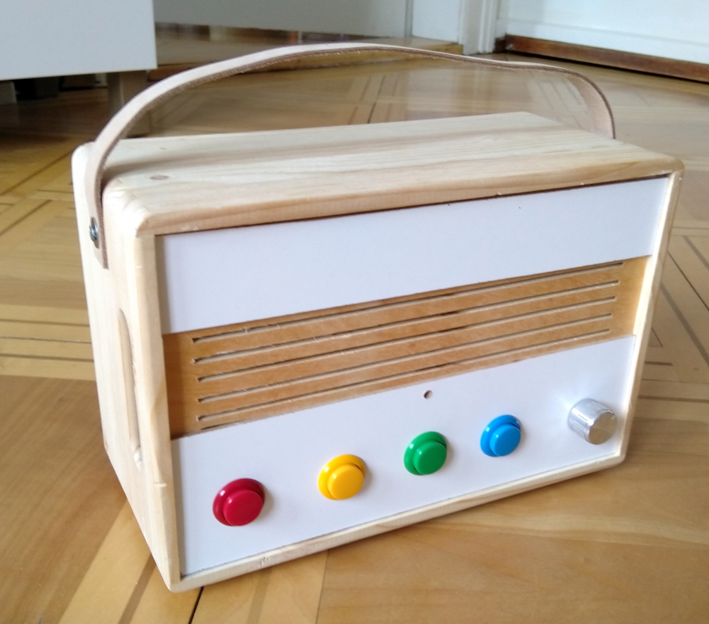
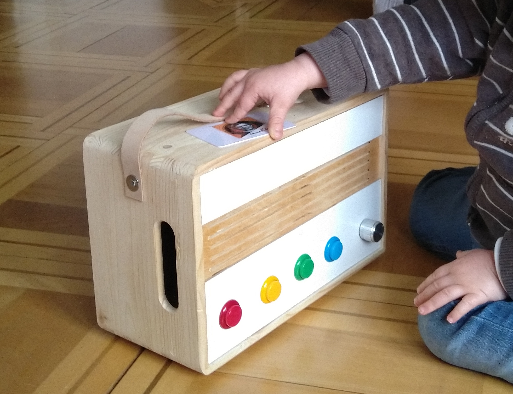
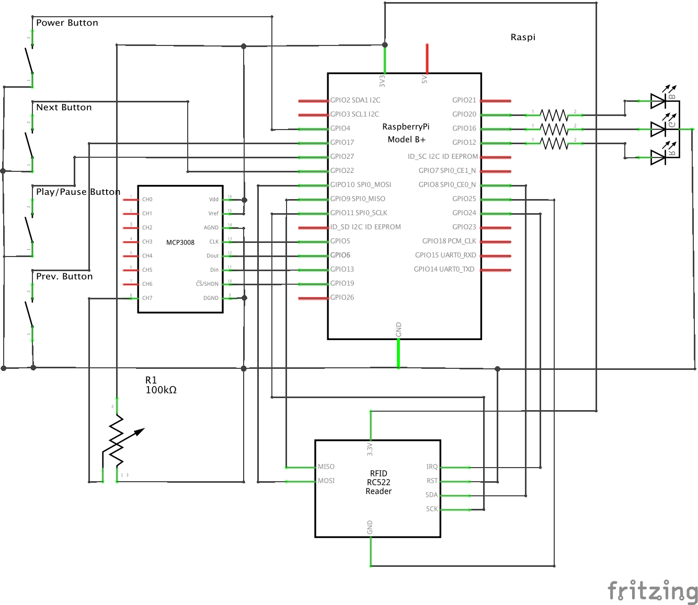

# Lolo Musicbox
A simple Raspberry Pi NFC musicbox for children, the NFC tags trigger songs or playlists.


Finished product.


Inside the box.


In action.

## Software Setup
Ten steps to setup the Lolo-Musicbox. Some of them will be explained in detail:
1. Prepare SD with Raspbian
1. Configure WIFI and SSH
1. Boot up the Raspberry Pi, connect via SSH, use raspi-conf for basic setup
1. Install Git
1. Clone this repo
1. Run `setup.sh`
1. check `config.py`
1. Reboot the Raspberry Pi
1. Copy music onto the Lolo-Musicbox
1. Enjoy

### Prepare SD with Raspbian
Tested with 'Raspbian Stretch Lite', see https://www.raspberrypi.org/downloads/raspbian/


### Configure WIFI and SSH
To activate WIFI and SSH without booting the Raspberry Pi add the two files
to the root directory of the SD.

* To activate SSH add an empty file with the name `ssh`
* To configure and activate WIFI add a file with the name `wpa_supplicant.conf`,
containing the WIFI configuration.
```
country=US
ctrl_interface=DIR=/var/run/wpa_supplicant GROUP=netdev
update_config=1

network={
    ssid="<the-ssid-of-your-network>"
    scan_ssid=1
    psk="<the-password-to-your-network>"
    key_mgmt=WPA-PSK
}
```

### Basic setup with raspi-config
```
sudo raspi-config
```
* Change password: 1.
* Set new hostname to 'lolo': 2.N1.
* Don't wait for network on boot: 3.B1. No
* Set locale: 4.I1
* Set WIFI Country: 4.I4
 

### Install Git
```
sudo apt-get update && sudo apt-get install git
```

### Clone this repo
```
cd ~
git clone <url> lolo
```

### Run `setup.sh`
This installs the required software, registers the Lolo-Musicbox service, and 
tries to optimize the boot time.
``` 
cd ~/lolo
chmod +x setup.sh
./setup.sh
```

### Check `config.py`
All paths and GPIO pins are defined in `config.py`. Just check if the current setup,
hardware and software, matches the given values in `config.py`.

### Copy music onto the Lolo-Musicbox
See 'How the Lolo-Musicbox' works.

### Enjoy


## Hardware setup
The musicbox is based on a Raspberry Pi 3+. Additionally I used the following parts:

* MFRC522 RFID/NFC module (library [on Github](https://github.com/ondryaso/pi-rc522))
* MCP3008, 8-Channel 10-Bit ADC to control the volume with a potentiometer 
(see: [Adafruit tutorial](https://learn.adafruit.com/reading-a-analog-in-and-controlling-audio-volume-with-the-raspberry-pi))
* TPA2012, Stereo 2.1W Class D Audio Amplifier (see [Adafruit](https://www.adafruit.com/product/1552))
* 4 arcade buttons
* RGB LED (with according resistors)
* 2 small 4Ω speakers
* 3.5mm audio jack breakout
* 2 NCR18650B LiIon batteries (3.7V)
* TP4056 LiPo battery charger module
* MT3608, DC-DC Step Up Converter, to step up the 3.7V from the batteries to 5V needed by the Raspberry Pi


Please note, that due to a bug in the Fritzing component, the RST and the GND out-pin of the RC522 reader
are switched.


## Issues/Learnings/Things that need improvement
* Rethink the wiring and placement of the parts on the perfboard. Short wires and bad placement makes the placement of the perfboard in the case harder than necessary
* Consider using a digital rotary encoder to set the volume. The potentiometer with the AD converter is not very percise and produces 'volume-jumps' from time to time.
* Add a powerswitch to disconnect the battery from the Raspberry Pi. The battery will be drained, even when the Raspberry is shut down. At least it seems like it does.
* The TP4056 battery charger module supports charging and using the battery at the same time, but if the battery charge is to low, the Raspberry Pi will go into a reboot loop. This must be improved.
* Also, the TP4056 gets quite hot when charging the battery. Consider using a heatsink.
* Boot time is still quite long. After starting the box there is about 20s waiting time without any indication that the musicbox was started. Needs imporvement.
* Async LED blinking and pulsing is hard to control, find cleaner solution.
